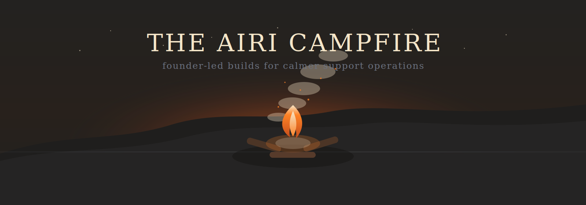
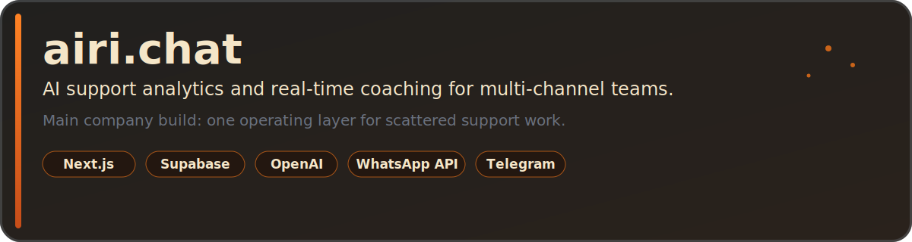
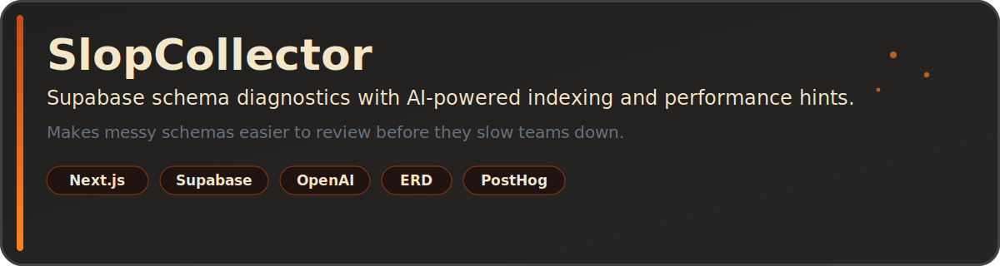
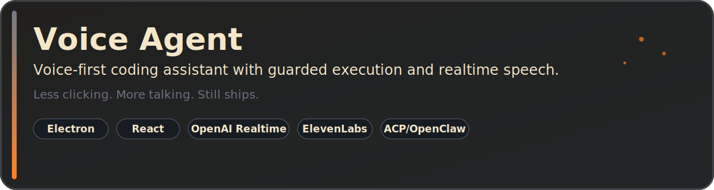

  

  <strong>Samat Kalshabekov</strong> 
  Co-founder & CTO at <a href="https://www.airi.chat">airi.chat</a>. I build AI tools for support teams that need less noise and more signal.

  
  
  

  

  

  

## About

I work on support operations, AI product systems, and founder-led growth. Most of my time goes into `airi.chat`, where we help teams understand what is happening across WhatsApp, Telegram, Email, and web chat.

I like simple product loops: talk to users, ship, measure, fix the awkward part, repeat. If a dashboard needs a tour guide, it probably needs a redesign.

## Projects

### airi.chat

- AI support analytics, real-time coaching, and multi-channel operations.
- Built for teams that want support quality, customer pain, and agent performance in one place.
- Live: https://www.airi.chat
- Core app repo: private for now.

### SlopCollector

- Supabase schema diagnostics with indexing and performance hints.
- Useful when the database still works, but everyone is afraid to ask why.
- Repo: https://github.com/Fatdrfrog/slopcollector
- Live: https://slopcollector.vercel.app

### Voice Agent

- Voice-first assistant for coding and operator workflows.
- Experimental, practical, and best used after coffee.
- Repo: https://github.com/Fatdrfrog/voice-agent

## Current Focus

- Better onboarding for non-technical support operators.
- Clear AI features that explain their work.
- Faster feedback loops between support, product, and leadership.
- Shipping with AI without shipping AI slop.

## Reach Out

Talk to me if you run a support-heavy team, build founder-led products, or care about AI agents, Supabase, Next.js, and product feedback loops.

  

## Automated Signals

These cards are generated by external README services. If they are slow or cached, use the links above as the source of truth.

  
  

  This README was generated by GPT-5.5.

